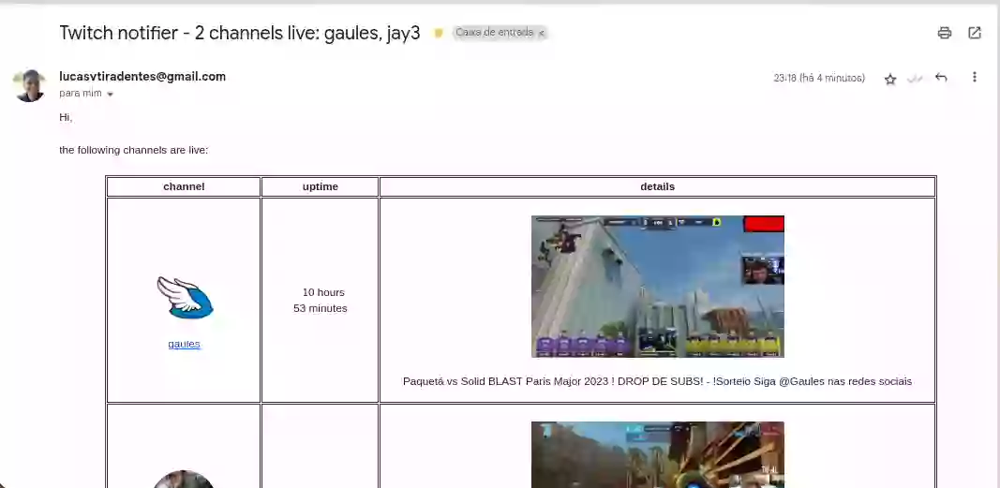
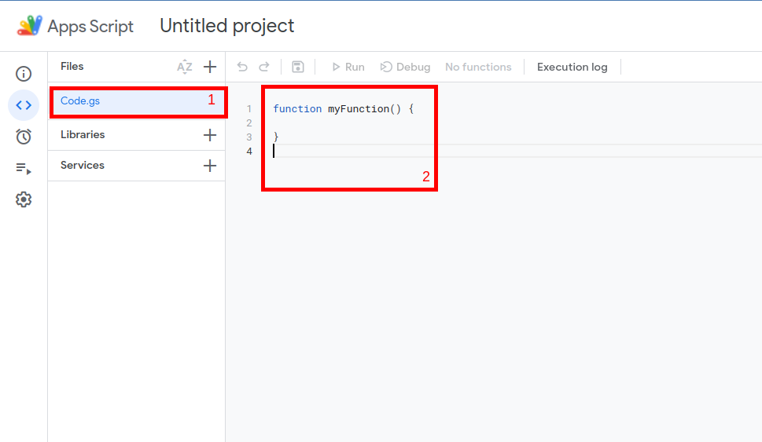
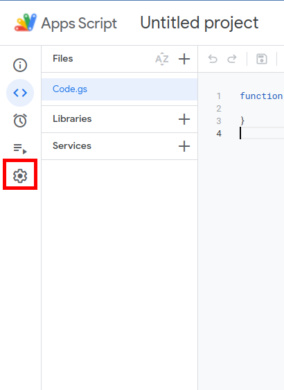
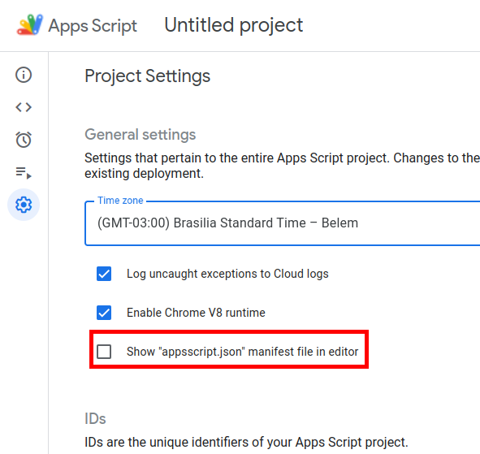
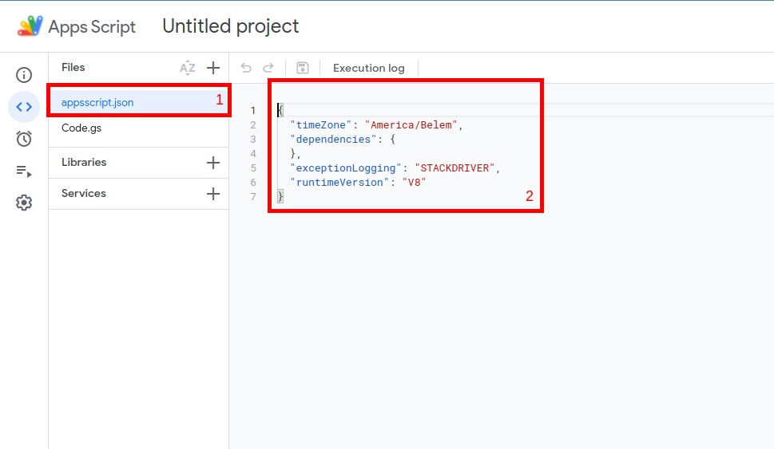
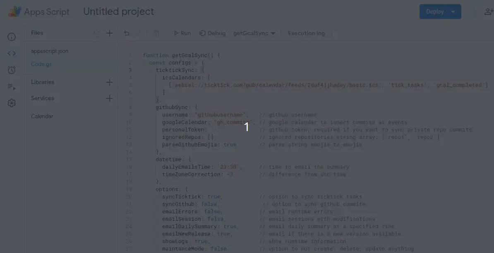

<h3 align="center">
  TWITCH NOTIFIER
</h3>

  
  
  

  <a href="#dart-features">Features</a> • <a href="#warning-requirements">Requirements</a> • <a href="#bulb-usage">Usage</a> • <a href="#books-about">About</a>

  
see <b>table of content</b>

  

    <ul>
      <!-- <li><a href="#trumpet-overview">Overview</a></li> -->
      <!-- <li><a href="#pushpin-table-of-contents">TOC</a></li> -->
      <li><a href="#dart-features">Features</a></li>
      <li><a href="#warning-requirements">Requirements</a></li>
      <li>
        <a href="#bulb-usage">Usage</a>
        <ul>
          <li><a href="#installation">Installation</a></li>
        </ul>
      </li>
      <li>
        <a href="#books-about">About</a>
        <ul>
          <li><a href="#license">License</a></li>
          <li><a href="#contributing">Contributing</a></li>
          <li><a href="#feedback">Feedback</a></li>
        </ul>
      </li>
    </ul>
  

## :trumpet: Overview

A simple way to get email notifications whenever your favorite twitch streamers go live.

Why? because twitch mobile app notifications are overwhelming, so I disabled then all and prefer receiving only alerts about my favorite streamers ([razah](https://www.twitch.tv/razah) and [theprimeagen](https://www.twitch.tv/theprimeagen)) through email ;)

## :dart: Features

&nbsp;&nbsp;&nbsp;✔️ send notifications whenever your favorite streamers go live; 
&nbsp;&nbsp;&nbsp;✔️ choose the minimum hour difference from the last notification; 

## :warning: Requirements

The only thing you need to use this solution is a `gmail/google account`.

## :bulb: Usage

### Installation

To effectively use this project, do the following steps:

  
1 - create a Google Apps Scripts (GAS) project

  

     
    
Go to the <a href="">google apps script</a> and create a new project by clicking in the button showed in the next image. 
    It would be a good idea to rename the project to something like "twitch-notifier".

    

  

  
2 - setup the twitch-notifier on GAS

  

     
    
Click on the initial file, which is the <b>rectangle-1</b> on the image.

    

    
Replace the initial content present in the <b>rectangle-2</b> with the content present in <a href="./src/notifier.js">notifier.js</a>.

    <blockquote>
      
⚠️ Warning 
       Remember to update the <code>CONFIGS</code> object according to your data and needs.

    </blockquote>
  

  
3 - allow the required google permissions

  

     
    
Go to the project settings by clicking on the <b>first image rectangle</b>. After that, check the option to show the <code>appsscript.json</code> in our project, a file that manages the required google api access.

    

      <table>
        <tr>
          <td width="400">
            
          </td>
          <td width="400">
            
          </td>
        </tr>
      </table>
    

    
Go back to the project files, and replace the content present in the <code>appsscript.json</code> with the following code:
    

    <pre>
{
  "timeZone": "Etc/GMT",
  "dependencies": {
    "enabledAdvancedServices": [
      {
        "userSymbol": "Calendar",
        "serviceId": "calendar",
        "version": "v3"
      }
    ]
  },
  "oauthScopes": [
    "https://www.googleapis.com/auth/script.scriptapp",
    "https://www.googleapis.com/auth/script.external_request",
    "https://www.googleapis.com/auth/script.send_mail",
    "https://www.googleapis.com/auth/userinfo.email"
  ],
  "exceptionLogging": "STACKDRIVER",
  "runtimeVersion": "V8"
}</pre>
  

  
4 - setup the twitch-notifier to run automatically every x minutes

  

     
    
Just follow what the bellow image shows, which is to select the <code>setup</code> function and run it. 
    After, a popup will appear asking your permission, and you'll have to accept it.

    

  

## :books: About

## License

This project is distributed under the terms of the MIT License Version 2.0. A complete version of the license is available in the [LICENSE](LICENSE) file in this repository. Any contribution made to this project will be licensed under the MIT License Version 2.0.

## Contributing

If you are a typescript developer, we would kind and happy accept your help:

- The best way to get started is to select any issue from the [`good-first-issue`](https://github.com/lucasvtiradentes/twitch-notifier/issues) label;
- If you would like to contribute, please review our [Contributing guide](docs/CONTRIBUTING.md) for all relevant details.

Another ways to positivily impact this project is to:

- **:star: Star this repository**: my goal is to impact the maximum number of developers around the world;
- ✍️ **Fix english mistakes** I might have made in this project, may it be in the DOCS or even in the code (I'm a portuguese natural speaker);
- [:heart: Say thanks](https://saythanks.io/to/lucasvtiradentes): kind words have a huge impact in anyone's life;
- [💰 Donate](https://github.com/sponsors/lucasvtiradentes): if you want to support my work even more, consider make a small donation. I would be really happy!

## Feedback

Any questions or suggestions? You are welcome to discuss it on:

- [Github issues](https://github.com/lucasvtiradentes/twitch-notifier/issues)
- [Email](mailto:lucasvtiradentes@gmail.com)

  

    
    
    
    
  

  
Made with ❤️ by <b>Lucas Vieira</b>

  
👉 See also all <a href="https://github.com/lucasvtiradentes/lucasvtiradentes/blob/master/portfolio/PROJECTS.md#TOC">my projects</a>

  
👉 See also all <a href="https://github.com/lucasvtiradentes/my-tutorials/blob/master/README.md#TOC">my articles</a>

